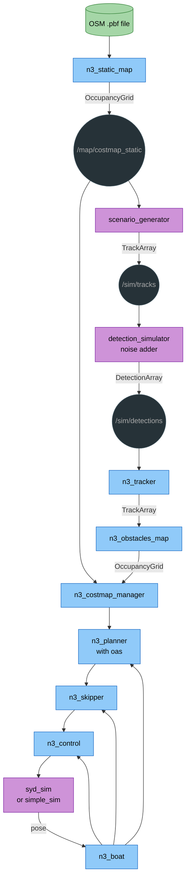
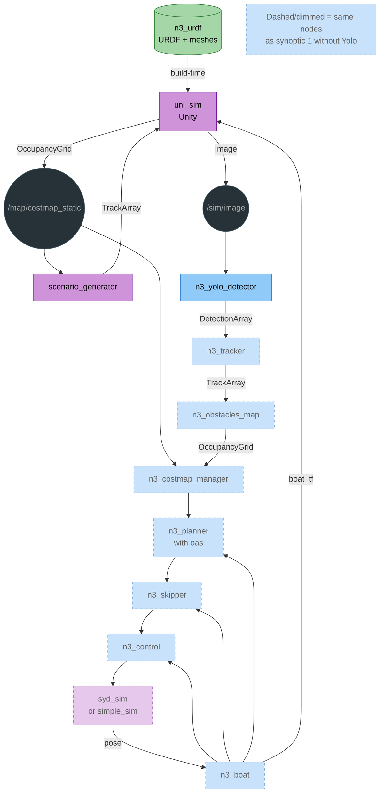
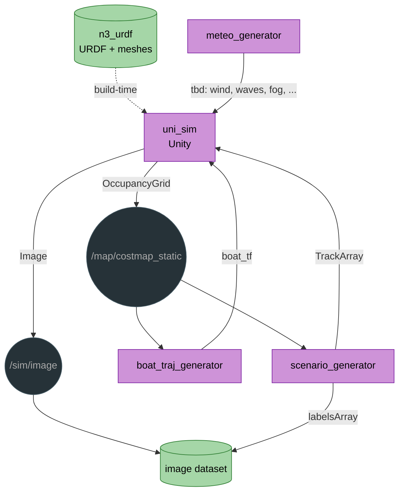
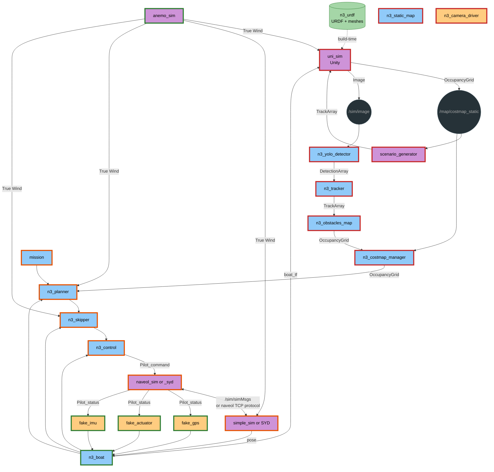

# Simulation architecture — scenario generator & obstacle pipeline

## Overview

The simulation stack generates maritime traffic scenarios, feeds them through
a detection pipeline, and provides inputs to the OAS (Obstacle Avoidance System)
planner.

## Architecture

### Simulation without Yolo detection : used to test the chain from n3_tracker to n3_planner

move



### Simulation with Yolo detection

Here we add uni_sim (Unity simulator for realistic image generation).
The detection simulator is replaced by the camera pipeline: uni_sim renders
images, n3_yolo_detector runs inference and outputs DetectionArray.
The static costmap also comes from uni_sim (no OSM file needed).



### Dataset collection mode

Lightweight mode for collecting training images without running the full
navigation stack. A `boat_traj_generator` node generates a cyclic trajectory
inside the navigable water area (from the costmap). uni_sim renders images
along this trajectory with the scenario traffic. Output: a labeled image
dataset ready for YOLO training. Notes it does not avoid collision so there may be some weird collision effect in
uni_sim.



* LabelsArray contains labels of targets that are in the camera field of view
* A label is
    * (x,y) position of the target in image coordinates (pixels, origin top-left)
    * dist to the target
    * (dx, dy) size of the target in pixels in image
    * class of the target (e.g. sailboat, swimmer, etc.)

### Complete detailed simulation architecture

Full simulation with all subsystems: vision pipeline (uni_sim + YOLO),
navigation stack, physics (naveol), fake sensors, wind simulation, and
mission management. This is the most realistic simulation mode, closest
to the real system.



Legend: border color = status (🟢 done, 🟠 wip, 🔴 not started), fill = node kind (blue=core, purple=sim, orange=driver)

---

## Data messages

Defined in `n3_new_msgs/msg/`. Accessible via `import n3_common.ros as ros`
then `ros.Track()`, `ros.DetectionArray()`, etc.

### Track

A moving object: ground truth from scenario_generator, or estimated state
from tracker. Stamp is in the TrackArray header, not repeated per track.

| Field   | Type                  | Description                          |
|---------|-----------------------|--------------------------------------|
| `id`    | `uint32`              | Unique track identifier              |
| `pose`  | `geometry_msgs/Pose`  | Position and orientation (ENU frame) |
| `twist` | `geometry_msgs/Twist` | Linear and angular velocity          |
| `type`  | `uint8`               | Track type enum (constants in msg)   |

Message: `n3_new_msgs/msg/Track`

Type constants are defined directly in the message (e.g. `Track.SAILBOAT`,
`Track.SWIMMER`). See [Track types](#track-types) table below.

### TrackArray

| Field    | Type              | Description                  |
|----------|-------------------|------------------------------|
| `header` | `std_msgs/Header` | Frame id and timestamp       |
| `tracks` | `Track[]`         | All active tracks this frame |

Message: `n3_new_msgs/msg/TrackArray`

### Detection

A noisy, sensor-like observation of an object. Published by the detection
simulator on `/sim/detections`. Also the message that real detectors
(camera, lidar, radar) will output. Stamp is in the DetectionArray header.

Uses `PoseWithCovariance` (ROS2 has no `PointWithCovariance`). Only the
position and its 3x3 block in the 6x6 covariance matrix are used.
Orientation fields are ignored.

| Field  | Type                               | Description                                           |
|--------|------------------------------------|-------------------------------------------------------|
| `id`   | `uint32`                           | Detection identifier (may differ from track id)       |
| `pose` | `geometry_msgs/PoseWithCovariance` | Detected position + uncertainty (ENU, covariance 6x6) |
| `type` | `uint8`                            | Classified object type (same enum as Track)           |

Message: `n3_new_msgs/msg/Detection`

Covariance layout (only position block used):

```
[ xx, xy, xz, 0, 0, 0,
  yx, yy, yz, 0, 0, 0,
  zx, zy, zz, 0, 0, 0,
   0,  0,  0, 0, 0, 0,
   0,  0,  0, 0, 0, 0,
   0,  0,  0, 0, 0, 0 ]
```

### DetectionArray

| Field        | Type              | Description               |
|--------------|-------------------|---------------------------|
| `header`     | `std_msgs/Header` | Frame id and timestamp    |
| `detections` | `Detection[]`     | All detections this frame |

Message: `n3_new_msgs/msg/DetectionArray`

## Track types

| Value | Enum name      | Description                         | Typical size (m) | Typical speed (kts) |
|-------|----------------|-------------------------------------|------------------|---------------------|
| 0     | `UNKNOWN`      | Unclassified object                 | —                | —                   |
| 1     | `SAILBOAT`     | Sailing vessel (monohull/catamaran) | 6 - 15           | 3 - 8               |
| 2     | `MOTORBOAT`    | Small motorboat / runabout          | 4 - 10           | 10 - 30             |
| 3     | `JETSKI`       | Personal watercraft                 | 2 - 3            | 20 - 45             |
| 4     | `KAYAK`        | Kayak or canoe                      | 3 - 5            | 2 - 5               |
| 5     | `PADDLEBOARD`  | Stand-up paddleboard                | 2 - 4            | 1 - 3               |
| 6     | `SWIMMER`      | Person in the water                 | 0.5              | 0.5 - 1.5           |
| 7     | `DINGHY`       | Small rowing / sailing dinghy       | 2 - 5            | 1 - 5               |
| 8     | `FISHING_BOAT` | Small fishing vessel                | 5 - 12           | 5 - 15              |
| 9     | `FERRY`        | Passenger ferry / tour boat         | 15 - 40          | 8 - 20              |
| 10    | `CARGO`        | Large commercial vessel             | 50 - 200         | 8 - 15              |
| 11    | `BUOY`         | Static navigation mark / buoy       | 0.5 - 2          | 0                   |
| 12    | `DEBRIS`       | Floating debris / log               | 0.5 - 3          | 0 - 0.5             |
| 13    | `WINDSURF`     | Windsurfer                          | 2 - 3            | 5 - 25              |
| 14    | `KITESURF`     | Kitesurfer                          | 2 - 3            | 10 - 30             |
| 15    | `PEDALO`       | Pedal boat                          | 2 - 4            | 1 - 3               |

For Sainte-Croix lake operations, the most common types are: `SAILBOAT`,
`KAYAK`, `PADDLEBOARD`, `SWIMMER`, `PEDALO`, `MOTORBOAT`.

## Scenario generator config (YAML)

```yaml
# scenario_example.yaml
scenario:
  name: "lake_crossing_traffic"
  description: "Moderate traffic on Sainte-Croix lake"
  duration_s: 600
  origin:
    lat_deg: 43.773
    lon_deg: 6.198

  defaults:
    noise:
      position_std_m: 1.0
      heading_std_deg: 5.0
      detection_probability: 0.95
      false_positive_rate: 0.01

  tracks:
    - id: 1
      type: sailboat
      spawn_time_s: 0
      despawn_time_s: 600
      waypoints:
        - { x: 200, y: 300, speed_kts: 4.5 }
        - { x: 500, y: 100, speed_kts: 5.0 }
      heading_mode: tangent  # tangent | fixed | cog
      noise_override:
        position_std_m: 0.5

    - id: 2
      type: motorboat
      spawn_time_s: 30
      despawn_time_s: 300
      waypoints:
        - { x: -100, y: 400, speed_kts: 15.0 }
        - { x: 600, y: 400, speed_kts: 12.0 }
        - { x: 600, y: 0, speed_kts: 18.0 }

    - id: 3
      type: swimmer
      spawn_time_s: 0
      despawn_time_s: 600
      waypoints:
        - { x: 50, y: 50, speed_kts: 1.0 }
        - { x: 80, y: 70, speed_kts: 0.8 }

    - id: 4
      type: kayak
      spawn_time_s: 60
      despawn_time_s: 500
      waypoints:
        - { x: 0, y: 200, speed_kts: 3.0 }
        - { x: 300, y: 250, speed_kts: 3.5 }

    - id: 5
      type: buoy
      spawn_time_s: 0
      despawn_time_s: 600
      waypoints:
        - { x: 150, y: 150, speed_kts: 0 }
      heading_mode: fixed

  random_traffic:
    enabled: false
    count: 5
    types: [ sailboat, kayak, paddleboard ]
    area:
      x_min: -500
      x_max: 500
      y_min: -500
      y_max: 500
    speed_range_kts: [ 1.0, 8.0 ]
```

### Config field reference

| Field                     | Type                 | Description                                   |
|---------------------------|----------------------|-----------------------------------------------|
| `scenario.name`           | `string`             | Scenario identifier                           |
| `scenario.duration_s`     | `float`              | Total simulation duration in seconds          |
| `scenario.origin`         | `{lat_deg, lon_deg}` | ENU origin for waypoint coordinates           |
| `defaults.noise.*`        | various              | Default detection noise parameters            |
| `tracks[].type`           | `string`             | Track type name (lowercase, see enum table)   |
| `tracks[].spawn_time_s`   | `float`              | Time (s) when the track appears               |
| `tracks[].despawn_time_s` | `float`              | Time (s) when the track disappears            |
| `tracks[].waypoints`      | list                 | Sequence of `{x, y, speed_kts}` in ENU meters |
| `tracks[].heading_mode`   | `string`             | `tangent` (follow path), `fixed`, or `cog`    |
| `tracks[].noise_override` | object               | Per-track noise override                      |
| `random_traffic`          | object               | Auto-generate random background traffic       |

## Node specifications

- [scenario_generator](sim_nodes/scenario_generator.md) — reads scenario YAML, interpolates waypoints, publishes
  TrackArray
- [boat_traj_generator](sim_nodes/boat_traj_generator.md) — generates cyclic boat trajectory within costmap, publishes
  pose + TF
